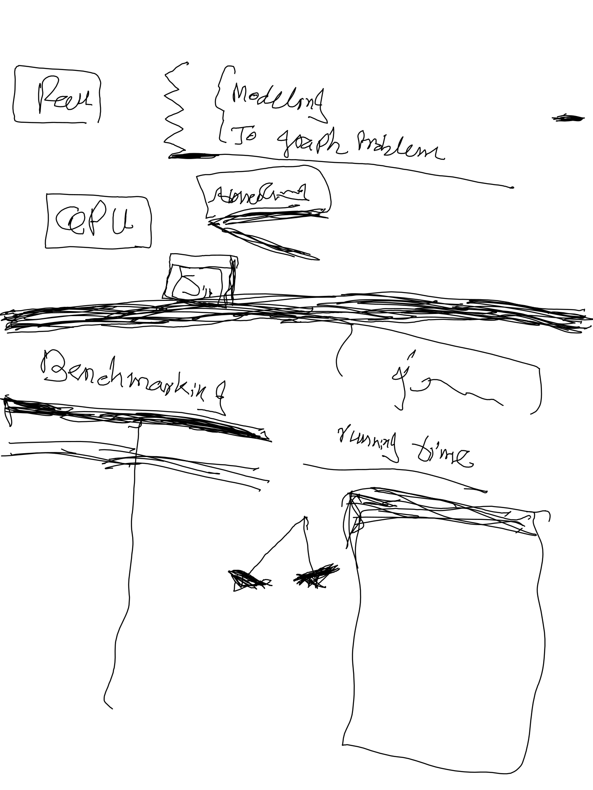
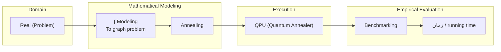

# D-Wave (Page 5 of 16)

> **Source**: reMarkable 2 (wirelessly synced)  
> **Topic**: Quantum Annealing Problem Formulation & Runtime Benchmarking  

---

## 1. Original Handwriting & Diagram

---

## 2. Executive Summary

This note outlines an end-to-end quantum computing pipeline: translating a real-world optimization problem through graph modeling into an embedding suitable for execution on a **Quantum Processing Unit (QPU)** via **quantum annealing**, followed by empirical benchmarking focusing on **running time** (`زمان`).

---

## 3. Architecture & Workflow Diagram

---

## 4. Full Multilingual Transcription

### Top Section (Modeling & Architecture)
- **`Real`** *(top-left box)*: The initial domain/real-world problem before abstraction.
- **`{ Modeling / To graph problem`**: Translating problem constraints and objective functions into an Ising Hamiltonian or QUBO graph formulation.
- **`Annealing`** *(callout block)*: The physical/computational annealing optimization procedure.
- **`QPU`** *(boxed)*: Hardware target (D-Wave Quantum Processing Unit).
- **`5th`**: Milestone or iteration tag.

### Middle Section (Benchmarking)
- **`Benchmarking`**: Experimental section for measuring solver efficiency.
- **`زمان`** *(Persian: "Zaman" = Time)*: Placed in brackets, paired with **`running time`**.
- Metric goal: Compare wall-clock and QPU annealing time against classical heuristics.

### Bottom Section (Graph Topologies)
- **Binary/Tree Branching** (`/\`): Depicting bipartite connectivity or tree decomposition into two base leaf clusters.
- **Results Canvas**: Open container for recording execution benchmarks.

---

## 5. Extracted Action Items

- [ ] Complete mathematical mapping from real problem to graph formulation (QUBO/Ising).
- [ ] Implement embedding onto the QPU hardware topology.
- [ ] Measure and record empirical execution duration (`running time / زمان`).
- [ ] Compare QPU benchmark results with classical algorithms.
